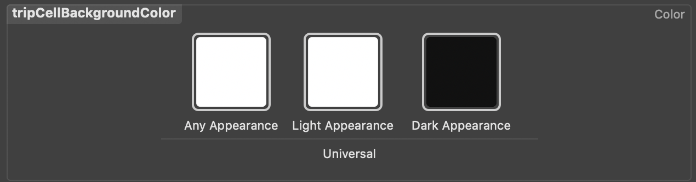

# iOS 13+ Dark Mode in Titanium

Full support for iOS 13+ dark mode in Titanium. Even works if colors are changed at runtime.



## The Magic

This project includes a CLI hook that generates semantic colors for the iOS Asset Catalog based on a JSON
file of colors that can even be used cross-platform and backwards compatible. It hooks into the SDK process
between generating the asset catalog and compiling the app, so you can even change colors between builds
without the need of clean-building the app again.

## Requirements

The following project- and OS-requirements are necessary:

- [x] Xcode 11+
- [x] Asset Catalog enabled
- [x] iOS 13+ (will fallback to `#000000` if called from older devices)
- [x] Titanium SDK 8.0.0+
- [x] A CLI plugin to hook into the asset catalog to generate the semantic colors
- [x] A JSON file to curate the color styles

## Installation

- [x] Copy the contents of the `plugin/` directory (`colors`) to `<project>/plugins`
- [x] Link the `colors` plugin in your tiapp.xml:
```xml
<ti:app>
  <!-- ... -->
  <plugins>
    <!-- ... -->
    <plugin version="1.0">colors</plugin>
  </plugins>
</ti:app>
```
- [x] Link the native `ti.darkmode` module to your project like any other native module
- [x] Alloy: Copy your color JSON file to `<project>/app/assets/json/colors.json`
- [x] Classic: Copy your color JSON file to `<project>/Resources/json/colors.json`
- [x] Map the colors on runtime for older devices or Android (this is just an example of how this could look like):
```js
function initializeColors() {
  const colors = Alloy.Globals.colors = JSON.parse(Ti.Filesystem.getFile('json/colors.json').read());
  const darkmode = OS_ANDROID ? undefined : require('ti.darkmode');

  for (const color of Object.keys(colors)) {
    Alloy.CFG.styles[color] = Utils.isiOSVersionOrGreater(13) ? darkmode.fetch(color) : colors[color].light;
  }

  // Use your colors like the following
  myLabel.backgroundColor = Alloy.CFG.styles.backgroundColor
}
```

## ToDos

- [ ] This may break incremental builds, since we generate files to the build dir that are not tracked by the CLI so far
- [ ] Make all color-setters ready to receive a `TiColor` instance (see [this pull request](https://github.com/appcelerator/titanium_mobile/pull/10937) for details)
- [ ] Eventually move this to the SDK

## License

MIT

## Author

Hans Knöchel
